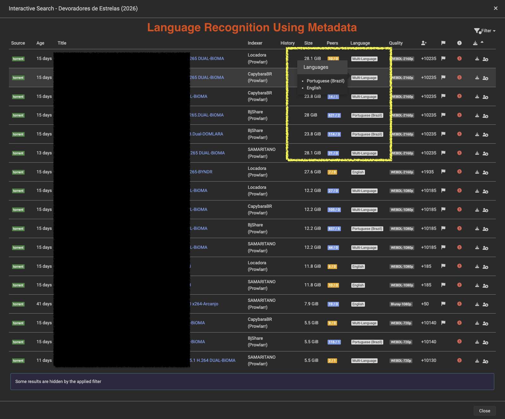
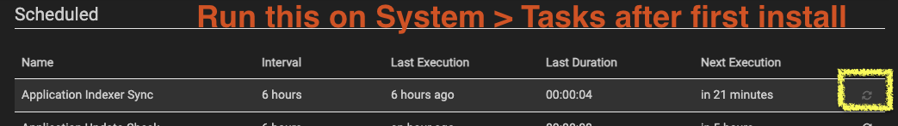
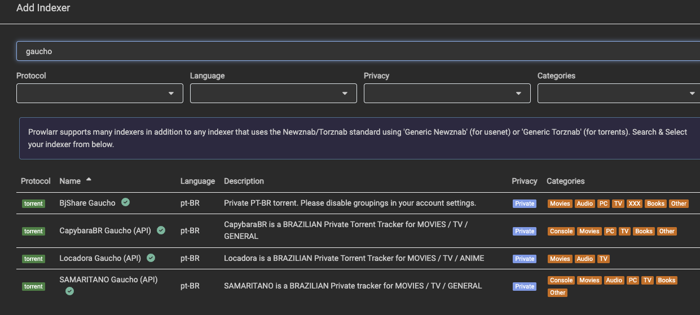

# Prowlarr Gaucho

This is a **community fork** of [Prowlarr](https://github.com/Prowlarr/Prowlarr) that tracks upstream stable releases and adds custom changes on top.

It is **not** the official Prowlarr project. For upstream support, use the [Servarr wiki](https://wiki.servarr.com/prowlarr) and [Prowlarr/Prowlarr](https://github.com/Prowlarr/Prowlarr).

## What this fork adds
With this fork you can get the following results.


### Cardigann language & subtitle metadata

The [`cardigann/langsubs`](../../tree/cardigann/langsubs) branch adds support for parsing `languages` and `subs` fields from Cardigann indexer definitions into release metadata.

### Cardigann mergeheader

The [`gmcouto/mergeheader`](../../tree/gmcouto/mergeheader) branch adds support for the `mergeheader` field in Cardigann definitions. Indexers that group torrents under section headers (for example audio or edition labels) can merge the closest preceding header row into each torrent row before parsing, so selectors can match metadata that lives outside the torrent `<tr>` itself.

### Custom indexers (not built into the image)

Additional Cardigann indexer definitions live in the separate [Prowlarr-Indexers](https://github.com/gmcouto/Prowlarr-Indexers) repository under [`custom-definitions/v11/`](https://github.com/gmcouto/Prowlarr-Indexers/tree/master/custom-definitions/v11). They are **not** bundled in the Docker image, but will automatically download (and update) by the definitions synchronization task.

| File | Indexer |
|------|---------|
| [`bjshare_gaucho.yml`](https://github.com/gmcouto/Prowlarr-Indexers/blob/master/custom-definitions/v11/bjshare_gaucho.yml) | BjShare Gaucho (disable grouping on site for this to work) |
| [`capybarabr_gaucho.yml`](https://github.com/gmcouto/Prowlarr-Indexers/blob/master/custom-definitions/v11/capybarabr_gaucho.yml) | CapybaraBR Gaucho (API) |
| [`locadora_gaucho.yml`](https://github.com/gmcouto/Prowlarr-Indexers/blob/master/custom-definitions/v11/locadora_gaucho.yml) | Locadora Gaucho (API) |
| [`samaritano_gaucho.yml`](https://github.com/gmcouto/Prowlarr-Indexers/blob/master/custom-definitions/v11/samaritano_gaucho.yml) | SAMARITANO Gaucho (API) |


## Releases

| Version | Release |
|---------|---------|
| Latest  | [Releases](../../releases/latest) |

## Docker

Replace the version tag with the [latest release](../../releases/latest):

```bash
docker pull ghcr.io/gmcouto/prowlarr:latest
```

```yaml
services:
  prowlarr:
    image: ghcr.io/gmcouto/prowlarr:latest
    container_name: prowlarr
    ports:
      - "9696:9696"
    volumes:
      - ./config:/config
    restart: unless-stopped
```

### Update your indexer definitions after first install
It is good for you to update your Indexer definitions after first install so you can have the `_gaucho` definitions.


Then you can add an indexer using the definitions to your app:


## Repository branches

| Branch | Purpose |
|--------|---------|
| `disclaimer` | This page — fork documentation and release automation |
| [`gmcouto-release`](../../tree/gmcouto-release) | Shippable code (upstream release + customizations) |
| [`gmcouto/infra`](../../tree/gmcouto/infra) | Docker and build workflow overlay |
| [`cardigann/langsubs`](../../tree/cardigann/langsubs) | Cardigann language/subtitle feature |
| [`gmcouto/mergeheader`](../../tree/gmcouto/mergeheader) | Cardigann mergeheader feature |

## How releases are built

1. A scheduled workflow checks [Prowlarr/Prowlarr](https://github.com/Prowlarr/Prowlarr) for new **stable** releases.
2. When a new version is found, upstream code is merged with `gmcouto/infra`, `cardigann/langsubs`, and `gmcouto/mergeheader` on `gmcouto-release`.
3. A version tag (e.g. `v2.3.5.5327`) triggers the build and publishes the Docker image to GHCR.

## Upstream

- **Source:** https://github.com/Prowlarr/Prowlarr
- **Docs:** https://wiki.servarr.com/prowlarr
